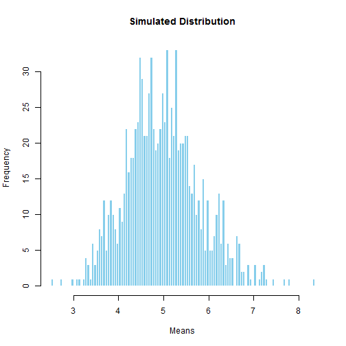

The Exponential Explorer
========================================================
author: Someone
date: Fri Aug 21 17:36:43 2015
autosize: true

Introduction
========================================================

The Exponential Explorer is an exciting new data app:

- Allows you to generate new exponential distributions automatically and show them in a histogram
- Adjustable number of simulations and trials
- Full control over the histogram through a slider control


How it Works
========================================================
Using the exciting new Shiny functionality in R-Studio the server code shown below generates the histogram based on user input, defined in the user interface file:


```r
shinyServer(function(input, output) {
    
    
    output$distPlot <- renderPlot({
        #x    <- faithful[, 2]  # Old Faithful Geyser data
        bins <- input$bins
        mns <- NULL
        n <- input$ntrials
        lambda <- input$lambda
        nsim <- input$nsim
        #n <- 40
        #lambda <- 0.2
        
        for (i in 1 : nsim) mns = c(mns, mean(rexp(n,lambda)))
        
        # draw the histogram with the specified number of bins
        hist(mns, breaks = bins, col = 'skyblue', border = 'white', xlab="Means", main="Simulated Distribution")
        
        
    })
})
```

Example of the App in Action
========================================================
- The following graph uses the code discussed to generate a dynamic simulated plot. (See GitHub for embedded code).
 

Where do I Get It?
========================================================

You can try this incredible new application at:

http://lmlearning.shinyapps.io/dataprod

Thank you!

